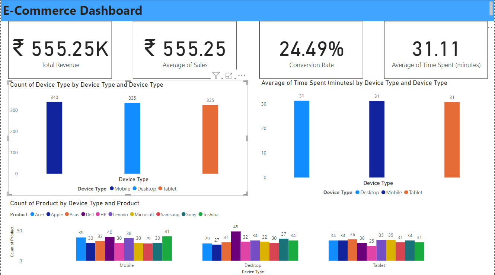

# DSM_PBI_CHALLENGE_CUSTOMER_REPOSITORY
 

 
**E-commerce Dashboard Overview**

**Dashboard Purpose:**
The E-commerce Dashboard developed is a powerful tool designed to provide a clear and comprehensive view of E-commerce business performance. It is equipped with a set of Key Performance Indicators (KPIs) and intuitive charts, enabling informed decision-making and deep insights into operations.

**Key Metrics:**

1. **Total Revenue:** This KPI card offers real-time visibility into our total revenue, to track revenue trends and assess overall financial performance.

2. **Average Time Spent:** The average time spent KPI card is pivotal for evaluating user engagement. It provides insights into the effectiveness of website's content and design in capturing and retaining user attention.

3. **Conversion Rate:** Our conversion rate KPI card illustrates the effectiveness with which we transform visitors into paying customers. It is a critical metric for optimizing the customer journey and driving growth.

4. **Average Sales:** This KPI card offers insights into the typical transaction value, helping stakeholders shape pricing strategies and targeted marketing efforts.

**Visual Insights:**

1. **Sales by Device Chart:** This visually engaging bar chart illustrates sales distribution across different device types. It gives us vital insights into user behavior, helping us recognize opportunities for optimizing device-specific user experiences.

2. **Sales by Product Chart:** The bar chart for sales by individual products is a window into our top-selling and underperforming products. This information informs inventory management and aids in designing effective marketing strategies.

3. **Time Spent on Website by Device Category Chart:** This chart provides a clear view of the time users spend on our website, segmented by device type. It guides us in making data-driven decisions about content and layout optimizations to enhance user engagement.

**How It Benefits Our Business:**
The E-commerce Dashboard serves as a central hub for real-time decision-making, providing teams with immediate access to vital performance metrics. It ensures that team can quickly adapt to market changes and emerging customer preferences, leading to improved conversion rates and, ultimately, increased revenue.

By embracing data-driven insights through this dashboard, teams are better equipped to streamline marketing strategies, enhance product offerings, and create a superior customer experience. It's a dynamic tool for accelerating our E-commerce business growth and staying ahead in a competitive market.

This E-commerce Dashboard exemplifies commitment to innovation and data-driven decision-making, ensuring company are well-positioned to drive our business forward with precision and agility.
