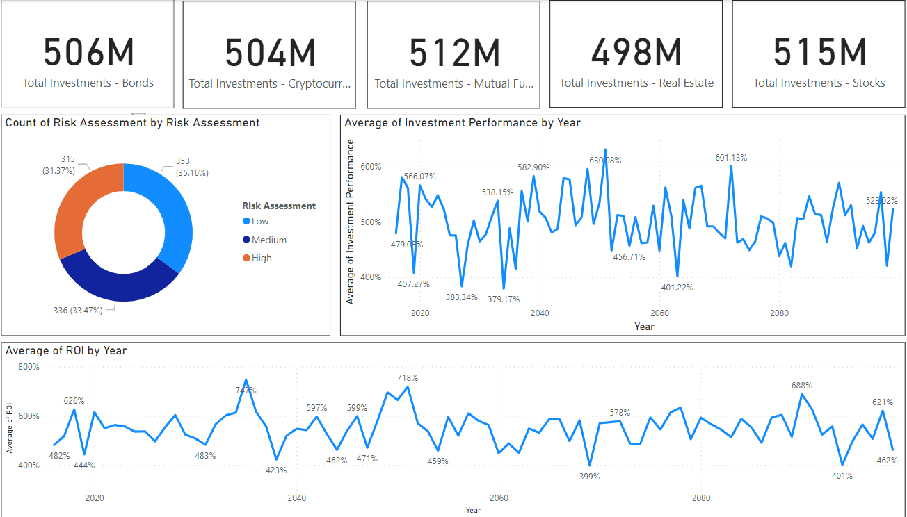

# DSM_PBI_CHALLENGE_CUSTOMER_REPOSITORY
 

### **Objective**
The primary objective of this project is to develop a comprehensive and insightful finance dashboard that provides a detailed view of key performance indicators (KPIs) for a financial institution. 
This dashboard aims to empower decision-makers, including business leaders and stakeholders, with the necessary information to assess the financial health of the institution, track investment performance, and analyze customer behavior.

### **Stakeholders**
**Business Leaders:** To gain a holistic view of the financial performance and make strategic decisions based on the insights provided by the dashboard.

**Finance Teams:** To monitor and analyze KPIs related to assets under management, net profit margin, customer churn, and cost per acquisition.

**Investment Teams:** To track investment types and assess their contribution to the overall portfolio.

### **Business Problem**
In the financial sector, staying informed about critical metrics is essential for making sound decisions. The business problem we address is the absence of a centralized platform that consolidates financial data, making it challenging for stakeholders to analyze and interpret key financial indicators. The finance dashboard aims to bridge this gap by providing a clear and concise overview of financial performance.

### **Dataset**
The dataset used in this project consists of synthetically generated financial data spanning the last two years, with a monthly time frame. It includes key metrics such as:
- Assets Under Management
- Net Profit Margin
- Customer Churn
- Cost Per Acquisition
- Investment Types
- Monthly Inflow and Outflow
- Customer Feedback

The dataset comprises over 1000 rows, ensuring a robust representation of financial activities.

### **Results**

Dashboard has allowed the teams to: 
- Monitor the growth of assets under management over time.
- Analyze the net profit margin to assess financial viability.
- Track customer churn rates and identify potential areas for improvement.
- Evaluate the cost-effectiveness of customer acquisition strategies.
- Visualize the distribution of investments across different types.
- Compare monthly inflow and outflow trends.

The dashboard is designed to facilitate data-driven decision-making, providing actionable insights for strategic planning and financial management.

### **Technologies Used**
- Power BI: Leveraged for creating dynamic and interactive visualizations.

### **Future Scope**
Integration with real-time financial data sources to provide live updates on the dashboard.
Implementation of predictive analytics to forecast financial trends based on historical data.
Enhancing the dashboard with additional features such as risk analysis and portfolio optimization insights.

### **Conclusion**
This finance dashboard serves as a powerful tool for financial institutions, offering a centralized hub for critical KPIs. By providing a visually intuitive representation of financial data, it empowers stakeholders to make informed decisions, thereby contributing to the institution's growth and financial success.