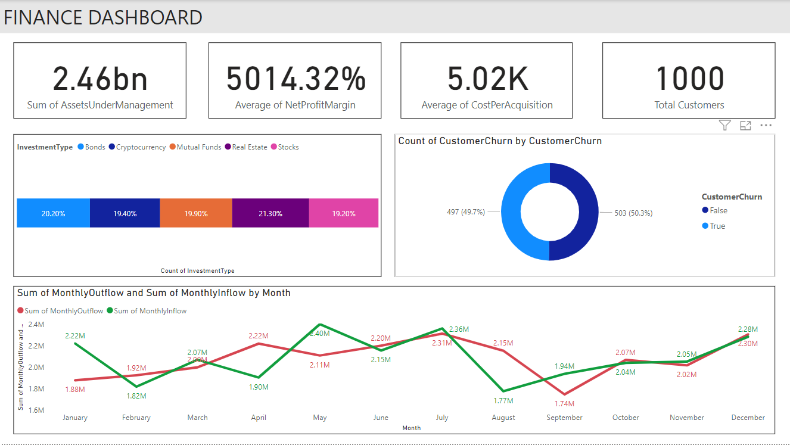

# DSM_PBI_CHALLENGE_CUSTOMER_REPOSITORY
 

### **Objective**
The primary objective of this project is to create a dynamic and interactive dashboard that provides valuable insights into the financial performance of an investment portfolio. By leveraging key performance indicators (KPIs) and visualizations, this dashboard aims to empower business leaders and stakeholders with actionable information for strategic decision-making.

### **Stakeholders**
**Financial Executives:** To assess the overall health of the investment portfolio, make informed decisions, and strategize for future financial growth.

**Marketing Teams:** To identify trends in customer acquisition costs and tailor marketing strategies to attract high-value clients.

**Customer Service Teams:** To understand customer behavior and address concerns related to investment types and churn.

### **Business Problem**
In the complex landscape of investments, having real-time insights into key metrics is crucial. The challenge addressed by this dashboard is the lack of a centralized system that provides a comprehensive view of the investment portfolio's performance.
By consolidating data on assets under management, net profit margins, customer acquisition costs, and customer count, the dashboard aids in informed decision-making.

### **Dataset**
The dataset used in this project consists of data, comprising over 1000 rows of monthly data from January 2022 to December 2023. Key metrics include:

- **Assets Under Management (AUM):** The total value of investments managed by the portfolio.
- **Net Profit Margins:** The average profitability of the investment portfolio.
- **Average Cost per Customer Acquisition:** The average cost incurred to acquire a new customer.
- **Total Customers:** The overall count of customers in the investment portfolio.

### **Results**
The Investment Dashboard delivers the following insights:

- **Investment Type Distribution:** A visual breakdown of investments by type (bonds, cryptocurrency, mutual fund, real estate, stocks).
- **Customer Churn Analysis:** Count of customers who have ceased their investments, aiding in retention strategies.
- **Monthly Inflow vs. Outflow:** Visualization of the balance between funds coming into the portfolio and funds going out.

The user-friendly design facilitates easy interpretation, enabling stakeholders to make informed decisions regarding investment strategies and customer engagement.

### **Technologies Used**
- **Power BI:** For creating interactive and dynamic visualizations.

### **Future Scope**
- **Real-time Integration:** Connecting the dashboard to live data sources for up-to-the-minute insights.
- **Predictive Analytics:** Implementing forecasting models to anticipate future investment trends.
- **Enhanced Features:** Incorporating additional features such as customer satisfaction analysis and investment performance benchmarks.

### **Conclusion**
The Investment Dashboard is a powerful tool that harnesses the potential of data to drive strategic decisions in the financial domain.
By providing a clear and intuitive visualization of key performance metrics, it empowers stakeholders to optimize investment strategies, reduce customer acquisition costs, and enhance overall portfolio profitability.
This project showcases the transformative impact of data-driven insights on investment management and business growth.