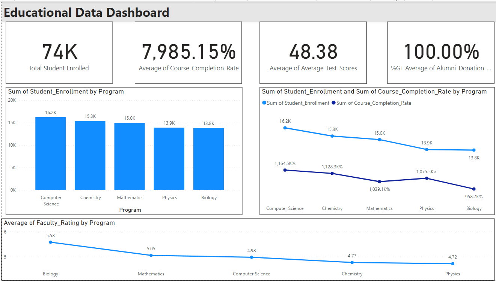

# DSM_PBI_CHALLENGE_CUSTOMER_REPOSITORY
 

 
### **Objective**
The primary objective of this project is to develop a comprehensive and insightful dashboard for the education sector. The dashboard aims to provide a visual representation of key performance indicators (KPIs) in the realm of student enrollment, course completion, average test scores, alumni donation rates, and faculty ratings. By consolidating this information, the dashboard empowers educational leaders and stakeholders with actionable insights for informed decision-making.

### **Stakeholders**

**Academic Administrators:** To assess overall institutional performance, identify trends, and strategize improvements based on data-driven insights.
**Faculty Members:** To gauge their effectiveness through faculty ratings and understand course completion rates.
**Alumni Engagement Teams:** To track donation rates and tailor engagement strategies for alumni.

### **Business Problem**

In the fast-evolving landscape of education, having a centralized platform for tracking and visualizing key metrics is crucial. The business problem we address is the need for a unified dashboard that provides a holistic view of the educational institution's performance, including student metrics, course completion, and alumni engagement. By centralizing this data, we aim to facilitate data-driven decision-making and enhance the overall educational experience.

### **Dataset**

The dataset used in this project contains synthetic data representing 1000 rows of monthly information, spanning from January 2020 to December 2022. It includes metrics such as:
- Student Enrollment
- Course Completion Rate
- Average Test Scores
- Alumni Donation Rate
- Faculty Ratings

This dataset provides a comprehensive view of the institution's performance, offering insights into enrollment patterns, academic achievements, alumni contributions, and faculty effectiveness.

### **Results**

Upon completion, the education dashboard will offer an intuitive visualization of key KPIs, allowing for:
- Monitoring student enrollment trends over time.
- Assessing course completion rates and academic performance.
- Tracking alumni donation rates to measure institutional support.
- Evaluating faculty ratings for continuous improvement.

The user-friendly design of the dashboard facilitates easy interpretation of complex data, enabling stakeholders to make informed decisions in the dynamic educational landscape.

### **Technologies Used**

- Power BI: Chosen for its capability to create interactive and dynamic visualizations.

### **Future Scope**

- Integration with real-time data sources for live updates on student enrollment and other metrics.
- Implementation of predictive analytics to forecast enrollment trends and academic performance.
- Enhancement with additional features such as student feedback analysis and departmental performance insights.

### **Conclusion**

This project exemplifies the power of data in steering educational decisions. The interactive dashboard provides a consolidated view of key metrics, supporting academic administrators, faculty, and alumni engagement teams in making informed decisions. It stands as a valuable tool for promoting educational growth and continuous improvement.

