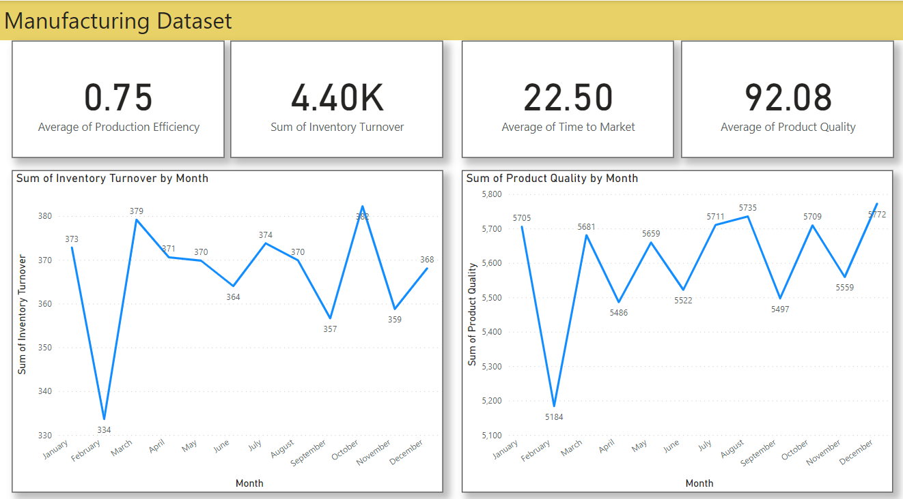

# DSM_PBI_CHALLENGE_CUSTOMER_REPOSITORY
 

### **Objective**
The primary objective of this project is to develop a comprehensive and insightful dashboard that offers a detailed overview of the manufacturing project's monthly performance metrics. The dashboard aims to empower business leaders and stakeholders with data-driven insights, enabling them to make informed decisions and strategize effectively.

### **Stakeholders**
**Business Leaders:** To assess manufacturing project performance and formulate strategic plans based on the data-driven insights provided by the dashboard.

**Quality Control Teams:** To monitor and analyze product quality trends, ensuring continuous improvement in manufacturing processes.

**Supply Chain Teams:** To evaluate inventory turnover and supplier reliability, optimizing the supply chain for efficiency and cost-effectiveness.

### **Business Problem**
In the complex landscape of manufacturing, having real-time insights into key performance indicators (KPIs) is crucial. The business problem we aim to address is the absence of a centralized system that presents a holistic view of the manufacturing project's performance, including production efficiency, product quality, and inventory turnover. By consolidating these metrics into a dynamic dashboard, we aim to facilitate data-driven decision-making and enhance overall project efficiency.

### **Dataset**
The dataset used in this project contains over 1000 rows of monthly data, synthetically generated from January 2022 to December 2023. It includes various KPI metrics such as:

- Production Efficiency
- Inventory Turnover
- Product Quality
- Time to Market

This dataset provides a detailed breakdown of the manufacturing project's performance on a monthly basis, offering insights into the efficiency and quality of production processes.

### **Results**
Upon completion, the dashboard will present an intuitive visualization of the manufacturing KPIs, enabling:

- Easy tracking of production efficiency trends.
- Monitoring and improvement of product quality over time.
- Evaluation of inventory turnover for efficient supply chain management.
- Assessment of supplier reliability to enhance overall supply chain performance.

The user-friendly design of the dashboard facilitates the interpretation of complex manufacturing data, contributing to a data-driven decision-making culture within the organization.

### **Technologies Used**
- Power BI: For creating interactive and dynamic visualizations.

### **Future Scope**
Integration with real-time data sources to provide live updates on the dashboard.
Implementation of predictive analytics to anticipate production challenges and optimize efficiency.
Enhancement of the dashboard with additional features such as predictive maintenance insights and workforce productivity metrics.

### **Conclusion**
This project showcases the transformative impact of leveraging data in manufacturing project management. The interactive dashboard brings critical insights to the forefront, enabling business leaders and stakeholders to make informed decisions, drive efficiency, and foster continuous improvement within the manufacturing domain.