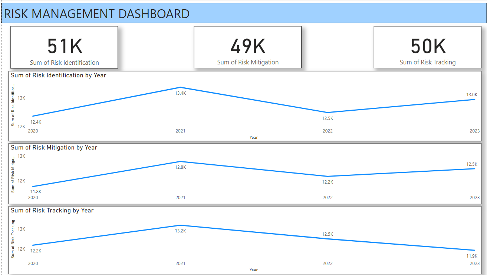

# DSM_PBI_CHALLENGE_CUSTOMER_REPOSITORY
 

 
### **Objective**

The primary objective of this project is to develop an insightful Risk Management Dashboard that empowers stakeholders with a holistic view of key performance indicators (KPIs) related to risk identification, tracking, and mitigation. This dynamic dashboard aims to enhance decision-making processes by providing real-time data-driven insights.

### **Stakeholders**

**Risk Management Team:** To proactively identify, track, and mitigate risks, ensuring the resilience and stability of ongoing projects.
**Project Managers:** To assess the effectiveness of risk mitigation strategies and allocate resources strategically.
**Executive Leadership:** To gain a high-level overview of the organization's risk landscape and make informed decisions.

### **Business Problem**

In the realm of project management, understanding and mitigating risks are critical for success. The business problem addressed by this dashboard is the need for a centralized system that consolidates key risk-related metrics. The goal is to provide stakeholders with a comprehensive understanding of risk identification, tracking, and mitigation efforts in real-time.

### **Dataset**

The dataset for this project comprises synthetic data, consisting of over 1000 rows of monthly metrics spanning from January 2020 to December 2023. Key metrics include:

- Risk Identification Count
- Risk Tracking Progress
- Risk Mitigation Effectiveness

The dataset allows for a nuanced analysis of the organization's risk landscape, facilitating strategic decision-making.

### **Results**

Upon completion, the dashboard will provide:

- Immediate insights into the frequency and nature of identified risks.
- A visual representation of risk tracking progress over time.
- Assessment of the effectiveness of risk mitigation strategies.

The user-friendly design of the dashboard ensures that stakeholders can easily interpret complex risk data, fostering a proactive risk management culture.

### **Technologies Used**

- Power BI: Employed for creating interactive and dynamic visualizations.

### **Future Scope**

- Integration with real-time project management tools for live updates.
- Implementation of predictive analytics to forecast potential risks based on historical data.
- Inclusion of additional features such as trend analysis and automated risk alerts.

### **Conclusion**

This project serves as a pivotal tool for empowering organizations in managing and mitigating risks effectively. By presenting key risk-related metrics in an interactive and visually appealing dashboard, stakeholders can make informed decisions, ensuring the success and resilience of ongoing projects. This endeavor underscores the transformative impact of data-driven insights in navigating the complexities of risk management.
