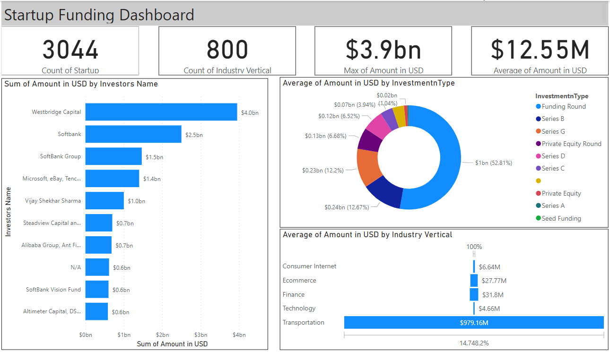

# DSM_PBI_CHALLENGE_CUSTOMER_REPOSITORY
 

 
### **Objective**
The primary objective of this project is to create a dynamic and interactive dashboard that provides comprehensive insights into the landscape of startup funding. By leveraging key performance indicators (KPIs) and visualizations, this dashboard aims to empower business leaders and stakeholders with data-driven insights to understand funding trends, identify key investors, and assess the distribution of funding across industry verticals.

### **Stakeholders:**
**Investment Managers:** To analyze and strategize investment decisions based on funding trends and investor preferences.

**Startups and Entrepreneurs:** To understand the competitive landscape, identify potential investors, and benchmark funding amounts.

**Industry Analysts:** To gain insights into funding distribution across different industry verticals and identify emerging trends.

### **Business Problem**
In the dynamic world of startups, having real-time insights into funding metrics is critical.
The business problem addressed by this dashboard is the lack of a centralized system that provides a comprehensive view of startup funding, including the count of startups, the diversity of industry verticals, the magnitude of funding received, and key players in the investment landscape.

### **Dataset**
The dataset used in this project is taken from Kaggle, encompassing over 3045 rows of monthly data from January 2015 to January 2020. Key metrics include:

**Count of Startups:** Total number of startups in the dataset.
**Count of Industry Verticals:** The variety of industry sectors receiving funding.
**Maximum Funding:** The highest funding amount received by a startup.
**Average Funding:** The average funding amount across all startups.

### **Results**

The Startup Funding Dashboard delivers the following insights:

**Top 10 Investors:** Visualization of the key investors actively participating in funding startups.
**Top 10 Investment Types:** A breakdown of the most common types of investments made in startups.
**Average Amount by Industry Vertical:** An analysis of the average funding amount received by startups in different industry verticals.
The user-friendly design facilitates easy interpretation, enabling stakeholders to make informed decisions regarding investment strategies, industry focus, and investor partnerships.

### **Technologies Used**

Power BI: For creating interactive and dynamic visualizations. And to filter out some data.

### **Future Scope**

**Real-time Integration:** Connecting the dashboard to live data sources for up-to-the-minute insights.
**Predictive Analytics:** Implementing forecasting models to predict future funding trends.
**Enhanced Features:** Incorporating additional features such as investor sentiment analysis and startup success rate.

### **Conclusion**
The Startup Funding Dashboard is a robust tool that harnesses the potential of data to drive strategic decisions in the dynamic landscape of startup investments. 
By providing a clear and intuitive visualization of key funding metrics, it empowers stakeholders to make informed decisions, identify trends, and foster innovation in the startup ecosystem. 
This project exemplifies the transformative impact of data-driven insights on investment management and business growth in the startup ecosystem.

